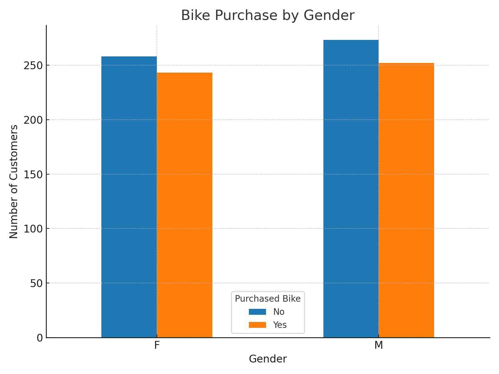

🚴‍♂️ Bike Buyers Analysis

📌 Overview

An Excel dashboard project analyzing customer demographics and purchasing behavior for bike sales. The dataset includes income, age, education, commute distance, and purchase status, allowing us to identify key factors that influence bike purchases.

📊 Features
	•	Clean and structured dataset.
	•	Pivot Tables for sales analysis.
	•	Interactive Dashboard with filters and charts.
	•	Insights on how income, age, and commute distance affect purchases.

🛠 Tools Used
	•	Microsoft Excel (Pivot Tables, Charts, Slicers).
	•	Data Cleaning & Transformation.
	•	Exploratory Data Analysis (EDA).

🚀 How to Use
	1.	Download or clone this repository.
	2.	Open Excel Project.xlsx.
	3.	Explore:
	•	bike_buyers → Raw data.
	•	Pivot Table → Aggregated insights.
	•	Dashboard → Interactive visuals.

📂 Files in This Project
	•	bike_buyers → Original dataset.
	•	Working Sheet → Cleaned dataset.
	•	Pivot Table → Analytical summaries.
	•	Dashboard → Visual report.
